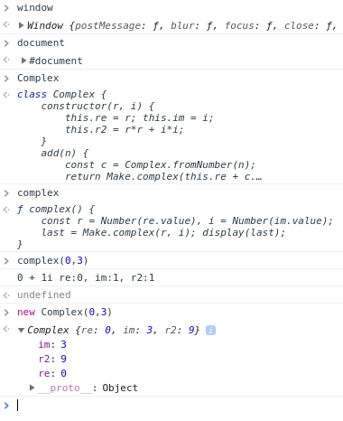

[Neden JavaScript?](https://eyler.blogspot.com/2018/06/neden-javascript.html) sorusuna üç cevap bulduktan sonra [örnek web sayfalarını](https://maeyler.github.io/JS/index.html) biraz daha geliştirdim. Kullandıkça JS daha sevimli görünmeye başladı. Bu satırların yazıldığı 2018 ortasında, [en sık kullandığımız web sayfalarının](https://www.wikiwand.com/en/Programming_languages_used_in_most_popular_websites) **tamamının** ön-yuzü (_client side_) JavaScript ile kodlanmış. Sadece bu bile, gençlere ne öğretmemiz gerektiğini açıkça gösteriyor.

### Java'dan JavaScript'e Geçiş
Peki bunca senedir yazdığımız Java kodu ne olacak? Zaman içinde hepsinin JS kodu olarak GitHub'da yayınlanacağını umuyorum. Bunun için otomatik çevirme yöntemleri mevcut. Bir örnek: [JSweet](https://github.com/cincheo/jsweet)

JavaScript'e geçenlere (en başta kendime) bu dönüşümü elle yapmalarını tavsiye ediyorum. Hem öğretici olur hem de JavaScript yaklaşımını daha iyi anlarız. Basit bir örnek olarak, Small-Simple-Safe sayfaları içinden seçtiğim [Decimal.java](https://github.com/maeyler/SmallSimpleSafe/blob/master/mae/tut/num/Decimal.java) -> [JS dönüşümünü](math/Number.js) inceleyelim:

  

1. `package` kavramı yok, sil (_namespace_ var ama şimdilik uzak duralım)
2. `public` kavramı yok, sil (nesnelerin içini saklamak da mümkün)
3. `int, float, String` gibi türleri sil (büyük rahatlık ama riskli)
4. _field_ (=property) tanımlarını sil (bu daha da riskli görünüyor)
5. _property_ kullanırken, `this.` ekle (Java'da izin var ama kullanmıyorduk)
6. `constructor` adını değiştir (class adı değişince bu metod aynı kalacak)

Hepsi bu kadar :) 

### Java Alışkanlıkları
Java imlasının çoğu aynı kalıyor ama alışmamız gereken önemli farklar var:

* Sayılar int olarak başlıyor, 32 bite sığmayınca ya da ondalık gerekince double oluyor ama programcının bundan haberi yok!
* `String` değerleri `Object` değil, _primitive_ (neyse ki yine _immutable_)
* Değişkenleri `let` ya da `const` olarak tanımlamak gerekiyor -- tür bilgisini JS kendisi ayarlıyor 
* `var` kullanımı çok sınırlı (sadece global değişkenler için)
* Her nesne bir Map (inanması güç ama öyle uygulanmış)
* `Array` yapısı dinamik olduğu için `java.util.ArrayList` ayarında
* Set ve Map uygulamaları alıştığımız kavramlara benziyor 
* Java programcılarına en zor gelecek kavramlar Function ve Prototype -- bunları henüz anlatacak kadar öğrenmedim

Peki JavaScript dilinde ne eksik? Thread kavramı eksik ve web sayfalarına hiçbir şekilde eklenemez görünüyor. Ayrıca, güvenlik açısından, dosya erişimi çok sınırlı ve yazma hakkı vermiyor. Lakin, yazdığım programların web sayfalarında bütün dünyaya açık olması o kadar büyük bir avantaj ki, bu iki eksikliğe gönül rahatlığı ile katlanıyorum.

### Console & Debugger
Yaygın kullanılan web tarayıcılarının hepsinde _Developer Tools_ (Ctrl-Shift-I) ile başlatılıyor. 

Yazılım geliştirmenin önemli bir parçası olan _Debugging & Testing_ bu ekranda yapılıyor.

* window -- global object
* document -- current document
* Complex -- class defined in Number.js
* complex() --  function defined in Numbers.html (called by Complex button)

_The power of JavaScript lies in its simplicity_

Ref: [JavaScript fundamentals](https://medium.freecodecamp.org/learn-these-javascript-fundamentals-and-become-a-better-developer-2a031a0dc9cf)

