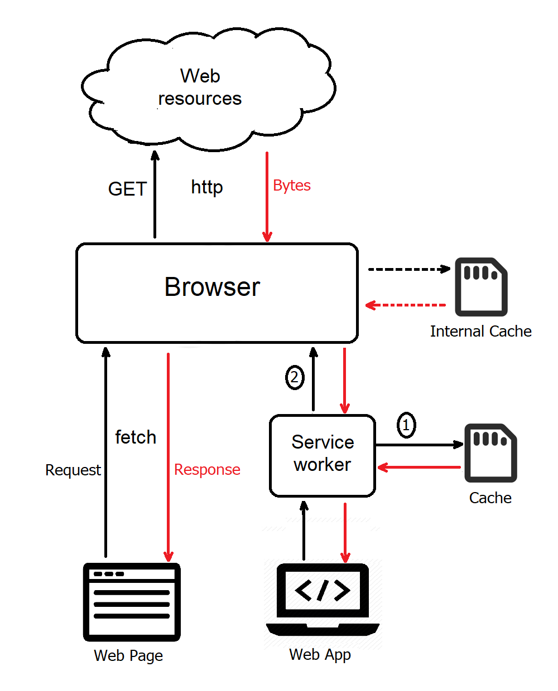

## Building a Progressive Web App
Here is a brief explanation of how to convert this web site to a PWA

### A Good Example Explains It Best
[Resilient Web Design](https://resilientwebdesign.com/) is a wonderful book that explains the history of the Web.

When you open this page, a PWA-aware browser (e.g. Chrome) will give the option to open it as an app.

### PWA -- Stage 1
Two steps will make your web page look like a web app under Android/Chrome

1. Add these two lines to the main page: 
```
<link rel="icon" sizes="192x192" href="images/JS.png">
<link rel="manifest" href="manifest.json">
```
and make `manifest.json` as follows:
```
{
  "name": "JavaScript samples",
  "start_url": "/JS/index.html",
  "display": "standalone",
  "background_color": "cyan",
  "icons": [
    {
      "src": "images/JS.png",
      "sizes": "192x192",
      "type": "image/png"
    }
  ]
}
```
2. Add related icons -- Just one icon is enough.
If a large icon (512x512) exists, it may be used as splash screen. <br>
[A wonderful tool](https://favicon.io) made by John Sorrentino will be very useful to make a full set of icons of the desired sizes from image/emoji/text. (5 stars!)


### Cache Usage
When a web page makes a fetch request for a web resource, the browser sends a http GET message to the server and returns the raw bytes as its response. It may use an internal (hidden) cache in this process, but the developers have no access to that cache. 



When a *web app* makes a similar request, a service worker acts as a proxy in between. It may get its response from the cache or from the browser depending on the caching strategy used, as explained below.

### PWA -- Stage 2
Add service worker `navigator.serviceWorker.register('/JS/sw.js')`

We will use the cache so that the app can work off-line. Two more steps are needed:

3. Supply a listener for `install` events -- add the static files to the cache
```
const CACHE ='JS'
const FILES = ['/JS/', '/JS/sss/', '/JS/index.html', ...]
function installCB(e) {
  e.waitUntil(
    caches.open(CACHE)
    .then(cache => cache.addAll(FILES))
    .catch(console.log)
  )
}
self.addEventListener('install', installCB)
```
4. Supply a listener for `fetch` events -- return the file from the cache, if not found fetch the remote file
```
function cacheCB(e) { //cache first
  let req = e.request
  e.respondWith(
    caches.match(req)
    .then(r1 => r1 || fetch(req))
    .catch(console.log)
  )
}
self.addEventListener('fetch', cacheCB)
```

### Automated Cache
The solution outlined above will work for static files that do not change in time, e.g. archive files or book chapters. But if the content is variable (as in a growing web site) we use a different approach: Fetch the file first, then save it in the cache. No need to check if it is modified... If fetch fails we can return what we find in the cache, which may not be up-to-date.
```
function save(req, resp) {
  return caches.open(CACHE)
  .then(cache => {
    cache.put(req, resp.clone());
    return resp;
  }) 
  .catch(console.log)
}
function fetchCB(e) { //fetch first
  let req = e.request
  e.respondWith(
    fetch(req).then(r2 => save(req, r2))
    .catch(() => { return caches.match(req).then(r1 => r1) })
  )
}
self.addEventListener('fetch', fetchCB)
```

### Summary of the Files
* `index.html` (modified)
* `manifest.json` (PWA info)
* `images/JS.png` (icon)
* `sw.js` (service worker)

### References
* [Using Service Workers](https://developer.mozilla.org/en-US/docs/Web/API/Service_Worker_API/Using_Service_Workers)
* [Building a PWA](https://medium.freecodecamp.org/progressive-web-apps-102-building-a-progressive-web-app-from-scratch-397b72168040)

<script src="navbar.js"></script>
