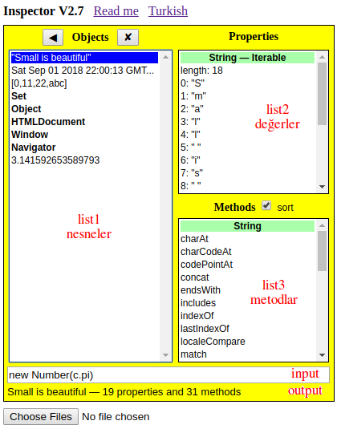

[Inspector](inspector.html) 
is a web page that shows the properties and the methods of a given object.



Three lists and two text boxes are shown on the screen for inspection:

**list1** shows the objects under inspection (`objA` in the program) <br>
All operations apply to the current object (`_`) selected <br>
Arrow keys navigate as expected, Delete key (✘) removes the object

A new object can be added to this list by three means: <br>
• Click on a property with bold font <br>
• Click a method name on list3 and enter its parameters <br>
• Enter a JavaScript command within the input box

**list2** shows the type and the properties of the current object <br>
If the object is _Iterable_, clicking on the name converts it to an _Array_ <br>
Values in bold are objects, light font indicates a primitive value

**list3** shows the type and the methods of the current object <br>
A click a method name brings a dialog to enter its parameters <br>
The parameters must be valid expressions in JavaScript syntax <br>
Even when the method requires no parameter, the dialog will appear
 
**input** box contains the JavaScript command used in `eval()` <br>
The command must be a valid expression in JS syntax <br>
The current object in list1 is denoted by `_` <br>
Previously selected object is denoted by `__`

**output** box gives a summary report on the last operation


### Initial objects
When the page is opened, inspector.js code is loaded <br>
HTML elements are made, and `init()` displays 8 objects:
```
var MENU, a, b, c;  //global variables
function init() {
    let s = "Small is beautiful", d = new Date(),
       len = 123, name = "Circle", pi = Math.PI, 
       sqrt = Math.sqrt, power = Math.pow;
    a = [0, 11, "22", "abc"]; b = new Set(a);
    c = {len, name, pi, sqrt, power};
    MENU = {s, d, a, b, c, window, navigator, document};
    Reflect.setPrototypeOf(MENU, Menu.prototype);
    display(MENU); 
}

• s is a String with 18 chars 
• d is a Date with no properties
• a is an Array with 2 numbers and 2 strings 
• b is a Set with the same members as a 
• c is an Object with 3 properties and 3 methods 
• document is the HTML document currently open 
• window contains global variables related to this page
* navigator gives information about the current browser
```

### Samples
Inspector page was developed especially for mobile devices <br>
Browsers already have console tools available for inspection <br>
This tool has some of the capabilities of the console

Several use cases in order of increasing difficulty:
```
// operating system -- synchronous
navigator.platform

// battery status -- immediate Promise
navigator.getBattery()

// GPS location -- Callback may take seconds
navigator.geolocation
_.getCurrentPosition(display)

// local text file -- immediate Callback
// select a file using 'Choose Files' button
// when File is selected, press the Back key
_.readAsText(__)   //result contains the file

// remote text file -- Promise may take seconds
fetch("../hard/test.txt")  //remote file
_.text()   //returns String
```

### Previous work
This work is based on Small-Simple-Safe dated 2004

[V0](evolve/SSS%20V0.html) HTML & CSS makes the correct view in 3 hours

[V0.2](evolve/inspector%20V0.2.html) 7 hours & 170 lines of code makes the basic functions

